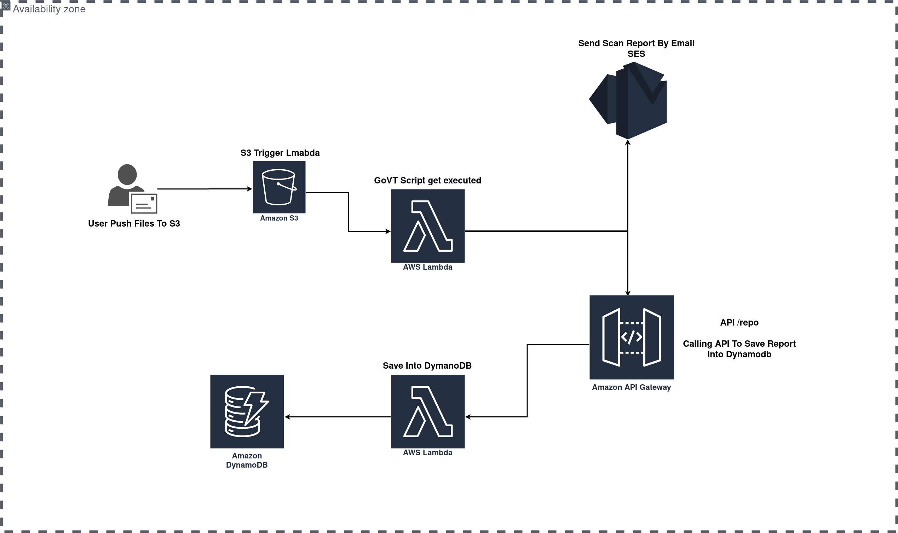

# GoVT

Tool to auto scan files after pushing it into S3 using VirusTotal API
 
 

## GoVT System design
 

With GoVT you can scan any files get published or pushed into S3 without your interaction by automating the pipeline using multiple resources
 

 

***  
## List of resources
~~~
 RS : 1. S3
      2. Lambda
      3. SES
      4. API Gateway
      5. DynamoDB
      6. Golang
      7. VirusTotal API  
~~~

## Why
~~~
 Every file user want to open can lead to breach if proper scan is not on place and with GoVT a full report will be sent by email 
~~~

> :warning: **Attacker can use obfuscation techniques to bypass detection and only deep level analytic can find any malicious payload injected!**

 
 

## GoVT Current Features
- [ ] Scan Files From S3 Using VT
- [ ] Alert Using SES
- [ ] Save Report In DB For Future Lookup

## GoVT Future Features
- [ ] SandBox Files
    - [ ] Collecting Network Traffic
    - [ ] File Behavior 